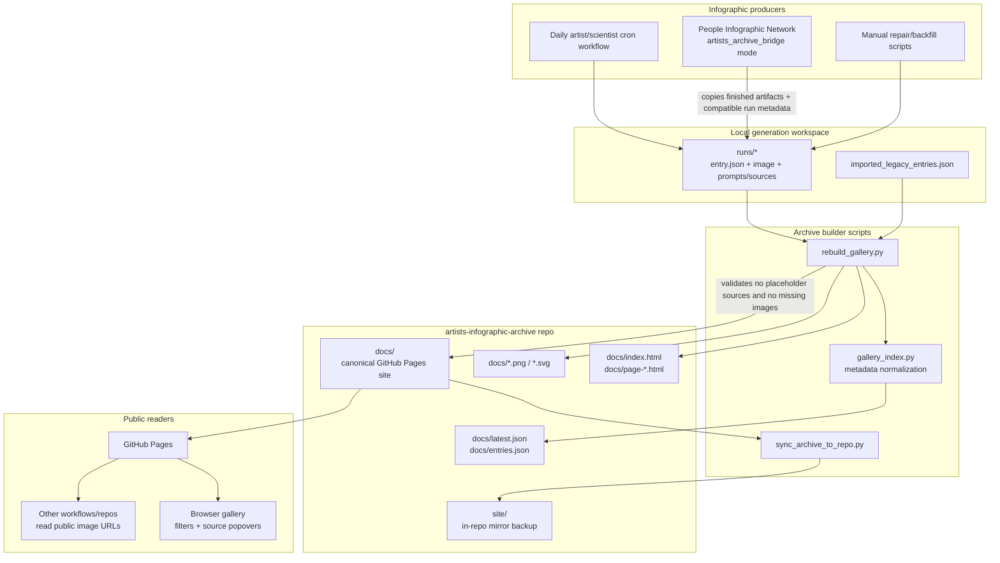

# Artists Infographic Archive architecture

This repo is the GitHub Pages archive for generated kid-friendly infographics. It is also the publish target used by the People Infographic Network bridge mode.

## System map

## Main data flow

1. A producer creates a run directory containing the generated image and metadata such as person/topic, date, sources, category, language, age-suitability details, and prompt/provenance files.
2. `rebuild_gallery.py` reads run metadata and legacy imported entries, validates that image references exist and that sources are not placeholder `example.com` URLs, then rebuilds the static gallery under `docs/`.
3. `gallery_index.py` normalizes category, language, search text, source counts, and age-suitability metadata for the generated `entries.json` index.
4. `docs/` is the canonical GitHub Pages output: image assets, paginated HTML, `latest.json`, and `entries.json`.
5. `sync_archive_to_repo.py` mirrors `docs/` into `site/` as an in-repo backup and preserves the builder/support scripts.
6. The public GitHub Pages site serves the static gallery to readers and to other workflows that need stable archive image URLs.

## Boundaries

- **Generation is outside this repo:** this archive stores and presents artifacts; it does not call image or research models directly.
- **`docs/` is canonical:** GitHub Pages and downstream consumers should treat `docs/` as the published artifact tree.
- **`site/` is a mirror backup:** it exists for local preservation, not as the primary publish root.
- **Bridge compatibility:** People Infographic Network can publish here by writing artists-compatible metadata and then invoking the rebuild/update flow.
