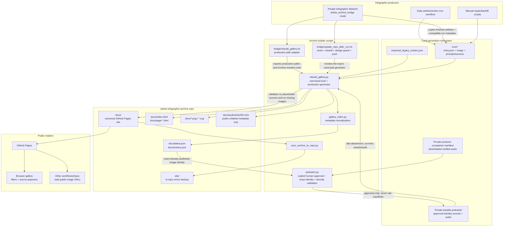

# Artists Infographic Archive architecture

This repo is the GitHub Pages archive for generated accessible infographics for everyone. It is also the publish target used by the People Infographic Network bridge mode.

## System map

```mermaid
flowchart TD
    subgraph Producers["Infographic producers"]
        Cron["Daily artist/scientist cron workflow"]
        PeopleNet["People Infographic Network\nartists_archive_bridge mode"]
        Manual["Manual repair/backfill scripts"]
    end

    subgraph Workspace["Local generation workspace"]
        Runs["runs/*\nentry.json + image + prompts/sources"]
        Legacy["imported_legacy_entries.json"]
        Companion["Private producer companion manifest\ndownloaded verified audio"]
        Store["Private durable podcasts/\napproved identity records + audio"]
    end

    subgraph Builder["Archive builder scripts"]
        Rebuild["rebuild_gallery.py\ncanonical local + production generator"]
        Index["gallery_index.py\nmetadata normalization"]
        Bridge["bridge/rebuild_gallery.sh\nproduction path adapter"]
        Publish["bridge/update_repo_after_run.sh\nreset + rebuild + design guard + push"]
        Sync["sync_archive_to_repo.py"]
        Import["podcasts.py\nexplicit human approval + exact identity + decode validation"]
    end

    subgraph Repo["artists-infographic-archive repo"]
        Docs["docs/\ncanonical GitHub Pages site"]
        Site["site/\nin-repo mirror backup"]
        Metadata["docs/latest.json\ndocs/entries.json"]
        Pages["docs/index.html\ndocs/page-*.html"]
        Images["docs/*.png / *.svg"]
        Audio["docs/audio/sha256.m4a\npublic whitelist metadata only"]
    end

    subgraph Public["Public readers"]
        GitHubPages["GitHub Pages"]
        Browser["Browser gallery\nfilters + source popovers"]
        OtherRepos["Other workflows/repos\nread public image URLs"]
    end

    Cron --> Runs
    PeopleNet -->|copies finished artifacts + compatible run metadata| Runs
    Manual --> Runs
    Legacy --> Rebuild
    Runs --> Rebuild
    Companion --> Import
    Metadata -->|exact already-published image identity| Import
    Import -->|approved only; never raw manifests| Store
    Store -->|late attachment, survives reset/rebuild| Rebuild
    PeopleNet --> Bridge
    Bridge -->|exports production paths and invokes tracked code| Rebuild
    PeopleNet --> Publish
    Publish -->|invokes the repo's canonical generator| Rebuild
    Rebuild --> Index
    Index --> Metadata
    Rebuild --> Pages
    Rebuild --> Images
    Rebuild --> Audio
    Rebuild -->|validates no placeholder sources and no missing images| Docs
    Docs --> Sync
    Sync --> Site
    Docs --> GitHubPages
    GitHubPages --> Browser
    GitHubPages --> OtherRepos
```

## Main data flow

1. A producer creates a run directory containing the generated image and metadata such as person/topic, date, sources, category, language, age-suitability details, and prompt/provenance files.
2. `rebuild_gallery.py` reads run metadata and legacy imported entries, validates that image references exist and that sources are not placeholder `example.com` URLs, then rebuilds the static gallery under `docs/`. Its input/output paths are configurable with `ARTISTS_ARCHIVE_BASE`, `ARTISTS_ARCHIVE_RUNS_DIR`, `ARTISTS_ARCHIVE_PUBLIC_ROOT`, and `ARTISTS_ARCHIVE_LEGACY_IMPORTED`, so local and production publishing use the same tracked generator.
3. `gallery_index.py` normalizes category, language, search text, source counts, and age-suitability metadata for the generated `entries.json` index.
4. In production, `bridge/update_repo_after_run.sh` resets to current `origin/main`, invokes that canonical generator, verifies the visual-learning-hub design contract, mirrors `docs/` to `site/`, and only then commits and pushes. A stale external generator cannot silently replace the design.
5. `docs/` is the canonical GitHub Pages output: image assets, paginated HTML, `latest.json`, and `entries.json`.
6. `sync_archive_to_repo.py` mirrors `docs/` into `site/` as an in-repo backup and preserves the builder/support scripts.
7. The public GitHub Pages site serves the static gallery to readers and to other workflows that need stable archive image URLs.

## Boundaries

- **Generation is outside this repo:** this archive stores and presents artifacts; it does not call image or research models directly.
- **`docs/` is canonical:** GitHub Pages and downstream consumers should treat `docs/` as the published artifact tree.
- **`site/` is a mirror backup:** it exists for local preservation, not as the primary publish root.
- **Bridge compatibility:** People Infographic Network can publish here by writing artists-compatible metadata and then invoking the rebuild/update flow.
- **Companion generation and review are private:** no NotebookLM authentication, notebook links, local paths or email state enters public metadata. Producer/human verifies spoken subject/language; importer verifies exact published date/image/language/assignment/subject, approvals, downloaded status, supported container and full decode. The intentionally Slovenian private Adelheid test cannot attach to the English image.
- **Durable late handoff:** `podcasts.py` stores approved content and records under `ARTISTS_ARCHIVE_PODCAST_STORE` (default `$ARTISTS_ARCHIVE_BASE/podcasts`), outside the repository's public trees. `rebuild_gallery.py` consumes that store on every rebuild, independent of prior generated JSON or raw run podcast proposals. Production reset/push-retry does not reset the private store. Back it up separately; resetting it loses the handoff.
- **Static audio hosting:** the builder copies only validated matching content-addressed audio to `docs/audio/`, mirrors with the rest of docs, and deletes orphaned audio. 50 MiB/import limit contains individual artifact growth; duplication and Pages bandwidth remain costs. No external URLs/expiring downloads accepted. M4A uses `audio/mp4`, preserved without transcoding.
- **Public podcast contract:** only URL, title, actual language, MIME, measured duration, fixed source provenance and an opaque identity appear as optional `podcast` objects in normalized entries/latest. Audio failure does not prevent image-only publication; private/unapproved/mismatched records fail closed.
- **Single-document listening:** canonical HTML includes one initially hidden native player plus tracked `assets/podcast-player.{js,css}`. Filters and same-document collection/pagination navigation replace only archive cards, never the player. Image opening during a selected episode uses a new tab. Separate documents/reloads stop playback; this explicit limitation avoids a disproportionate full-site router/redesign. No autoplay or bulk preloading.
